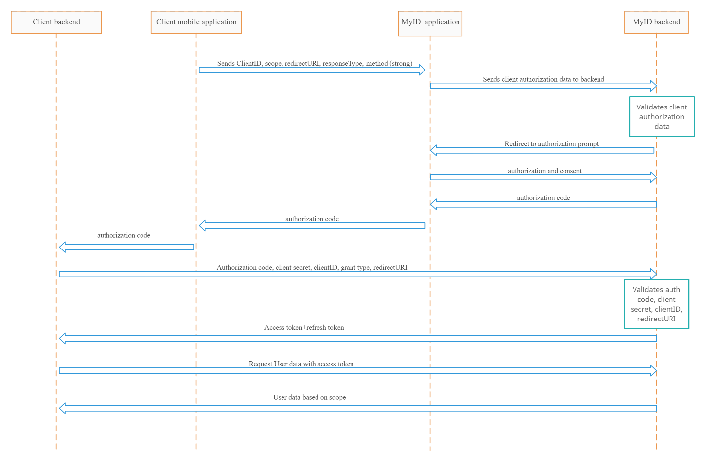

[русский](README.ru.md)

# myID SDK
MyID – bu O'zbekistonda masofaviy identifikatsiyalashning eng oson, qulay va ishonchli usuli.

## Talablar
myID SDK ni o'z loyihangizga ulashdan oldin siz bizdan maxsus `clinet_id` va `clinet_secrect` tokenlarini va SDK ni zip arxivini olishingiz kerak.

## Boshlashdan oldin
Pastda keltiriladigan kodlarni to'li ishlaydigan talqinini ushbu repozitoriyadan topish mumkun https://github.com/azamat7g/myidsdk_examples

## SDKni ulash
Modul urevinidagi `build.gradle` faylni ochamiz. Android qismiga maxsus repozitoriyani qo'shamiz va `minSdkVersion` ni 21 qilib qo'yamiz:

```gradle
android {
    ....

    defaultConfig {
        minSdkVersion 21
        ...
    }

    repositories {
        maven {
            url './libs/myid'
        }
        maven {
            url "https://storage.googleapis.com/download.flutter.io"
        }
    }
}
```

"dependencies" qismida SDKni ulaymiz:

```gradle
dependencies {
    ...

    implementation 'uz.uzinfocom.myidsdk:flutter_release:1.0'
}
```

va `app/libs` papkasini ichiga SDKni zip arxivdan yoyib yuboramiz. Fayllar joylashuvi quyidagi ko'rinishga kelishi kerak

```
├── libs
│   └── myid
│       └── uz
│           └── uzinfocom
│               └── myidsdk
│                   ├── flutter_release
│                   │   ├── 1.0
│                   │   │   ├── flutter_release-1.0.aar
│                   │   │   ├── flutter_release-1.0.aar.md5
│                   │   │   ├── flutter_release-1.0.aar.sha1
│                   │   │   ├── flutter_release-1.0.pom
│                   │   │   ├── flutter_release-1.0.pom.md5
│                   │   │   └── flutter_release-1.0.pom.sha1
│                   │   ├── maven-metadata.xml
│                   │   ├── maven-metadata.xml.md5
│                   │   └── maven-metadata.xml.sha1
│                   └── modules
│                       ├── ...
│                       ......
```

## SDKni loyihaga qo'shish
SDKni loyihaga qo'shish uchun maxsus Activity yaratish kerak. Buning uchun "Android studio" dasturida `File > New > Activity > Empty activity` tanlab yangi activity qo'shamiz. Activityga nom beramiz. Misol uchun `FaceIdActivity`. Activityni muvofaqiyatlik qo'shganimizdan keyin uni `FragmentActivity`dan extend olamiz.

Kotlin
```kotlin
class FaceIdActivity : FragmentActivity() {
```

Java
```java
public class FaceIdActivity extends FragmentActivity {
```

Shundan so'ng bir nechta o'zgaruvchilar yasaymiz

Kotlin
```kotlin
...

companion object {
    private const val FLUTTER_FRAGMENT = "flutter_fragment"
    private const val FLUTTER_ENGINE_ID = "flutter_engine"
    private const val FLUTTER_CHANNEL = "channel/myid"
    private var flutterFragment: FlutterFragment? = null
}

...
```

Java
```java
...

final String FLUTTER_FRAGMENT = "flutter_fragment";
final String FLUTTER_ENGINE_ID = "flutter_engine";
final String FLUTTER_CHANNEL = "channel/myid";
FlutterFragment flutterFragment;

...
```

Fragmentni hamma eventlari SDKga borishi uchun quyidagi kodni qo'shib qo'yamiz:

Kotlin
```kotlin
...

override fun onPostResume() {
    super.onPostResume()
    flutterFragment!!.onPostResume()
}

override fun onNewIntent(@NonNull intent: Intent) {
    super.onNewIntent(intent)
    flutterFragment!!.onNewIntent(intent)
}

override fun onBackPressed() {
    flutterFragment!!.onBackPressed()
}

override fun onRequestPermissionsResult(
    requestCode: Int,
    permissions: Array<String?>,
    grantResults: IntArray
) {
    super.onRequestPermissionsResult(requestCode, permissions, grantResults)
    flutterFragment!!.onRequestPermissionsResult(
        requestCode,
        permissions,
        grantResults
    )
}

override fun onUserLeaveHint() {
    flutterFragment!!.onUserLeaveHint()
}

override fun onTrimMemory(level: Int) {
    super.onTrimMemory(level)
    flutterFragment!!.onTrimMemory(level)
}
```

Java
```java
...

@Override
public void onPostResume() {
    super.onPostResume();
    flutterFragment.onPostResume();
}

@Override
protected void onNewIntent(@NonNull Intent intent) {
    super.onNewIntent(intent);
    flutterFragment.onNewIntent(intent);
}

@Override
public void onBackPressed() {
    flutterFragment.onBackPressed();
}

@Override
public void onRequestPermissionsResult(
        int requestCode,
        @NonNull String[] permissions,
        @NonNull int[] grantResults
) {
    super.onRequestPermissionsResult(requestCode, permissions, grantResults);
    flutterFragment.onRequestPermissionsResult(
            requestCode,
            permissions,
            grantResults
    );
}

@Override
public void onUserLeaveHint() {
    flutterFragment.onUserLeaveHint();
}

@Override
public void onTrimMemory(int level) {
    super.onTrimMemory(level);
    flutterFragment.onTrimMemory(level);
}
```

SDKni ishga tushirish va undan kelgan javobni ushlab olish uchun quyidagi kodni ishlatamiz:


Kotlin 

```kotlin

private fun attachFlutterFragment() {
    flutterFragment =
        supportFragmentManager.findFragmentByTag(FLUTTER_FRAGMENT) as FlutterFragment?
    if (null == flutterFragment) {
        flutterFragment =
            FlutterFragment
                .withCachedEngine(FLUTTER_ENGINE_ID)
                .shouldAttachEngineToActivity(true)
                .build() as FlutterFragment
    }

    supportFragmentManager
        .beginTransaction()
        .add(
            R.id.fragmentContainerView,
            flutterFragment!!,
            FLUTTER_FRAGMENT
        )
        .commit()
}

private fun setMethodChannels(flutterEngine: FlutterEngine) {
    MethodChannel(
        flutterEngine.dartExecutor.binaryMessenger,
        FLUTTER_CHANNEL
    ).setMethodCallHandler { call, result ->
        when (call.method) {
            "result" -> {
                val resultIntent = Intent()
                resultIntent.putExtra("code", call.arguments.toString())
                setResult(RESULT_OK, resultIntent)

                result.success(true)
                finish()
            }
        }
    }
}

```

Java

```java

private void attachFlutterFragment() {
    flutterFragment =
            (FlutterFragment) getSupportFragmentManager().findFragmentByTag(FLUTTER_FRAGMENT);
    if (null == flutterFragment) {
        flutterFragment =
                (FlutterFragment) FlutterFragment
                        .withCachedEngine(FLUTTER_ENGINE_ID)
                        .shouldAttachEngineToActivity(true)
                        .build();
    }

    getSupportFragmentManager()
            .beginTransaction()
            .add(
                    R.id.fragmentContainerView,
                    flutterFragment,
                    FLUTTER_FRAGMENT
            )
            .commit();
}

private void setMethodChannels(FlutterEngine flutterEngine) {
    new MethodChannel(
            flutterEngine.getDartExecutor().getBinaryMessenger(),
            FLUTTER_CHANNEL
    ).setMethodCallHandler(
            (call, result) -> {
                if ("result".equals(call.method)) {
                    Intent resultIntent = new Intent();
                    resultIntent.putExtra("code", call.arguments.toString());
                    setResult(RESULT_OK, resultIntent);

                    result.success(true);
                    finish();
                }
            }
    );
}

```

SDKni ishga tushirish va unga kerakli parametrlarni berib yuborish uchun qiydagi koddan foydalanamiz:


Kotlin
``` kotlin
private fun initFlutterEngine() {
    val flutterEngine = FlutterEngine(this)
    val bundle = intent.extras

    val uri = Uri.Builder()
    uri
        .appendPath("login")
        .appendQueryParameter("client_id", __YOUR_CLIENT_ID__)
        .appendQueryParameter("redirect_uri", __YOUR_REDIRECT_URL__)
        .appendQueryParameter("scope", "address,contacts,doc_data,common_data")
        .appendQueryParameter("language", "uz")
        .appendQueryParameter("scan_mode", bundle?.getString("mode"))
        .appendQueryParameter("passport", "AA1234567")
        .appendQueryParameter("birthday", "01.01.2000")
        //.appendQueryParameter("user_hash", "1234567891234567")

    flutterEngine.navigationChannel.setInitialRoute(uri.toString())
    flutterEngine.getDartExecutor().executeDartEntrypoint(
        DartExecutor.DartEntrypoint.createDefault()
    )

    FlutterEngineCache
        .getInstance()
        .put(FLUTTER_ENGINE_ID, flutterEngine)

    setMethodChannels(flutterEngine)
}
```


Java
```java
private void initFlutterEngine() {
    FlutterEngine flutterEngine = new FlutterEngine(this);
    Bundle bundle = getIntent().getExtras();

    Uri.Builder uri = new Uri.Builder();
    uri
            .appendPath("login")
            .appendQueryParameter("client_id", __YOUR_CLIENT_ID__)
            .appendQueryParameter("redirect_uri", __YOUR_REDIRECT_URL__)
            .appendQueryParameter("scope", "address,contacts,doc_data,common_data")
            .appendQueryParameter("language", "uz")
            .appendQueryParameter("scan_mode", bundle.getString("mode"))
            //.appendQueryParameter("user_hash", "1234567891234567")
            .appendQueryParameter("passport", "AA1234567")
            .appendQueryParameter("birthday", "01.01.2000");

    flutterEngine.getNavigationChannel().setInitialRoute(uri.toString());
    flutterEngine.getDartExecutor().executeDartEntrypoint(
            DartExecutor.DartEntrypoint.createDefault()
    );

    FlutterEngineCache
            .getInstance()
            .put(FLUTTER_ENGINE_ID, flutterEngine);

    setMethodChannels(flutterEngine);
}
```

`initFlutterEngine` funksiyada Uri orqali hamma parametrlarni SDKga berib yuboramiz.
- client_id: siz uchun berilgan mahsus ID
- redirect_uri: ulanish paytida malumot almashish URL manzili
- scope: sizga kerakli bo'lgan ma'lumotlar guruhi ro'yhati
- language: SDKni interfeys tili. Mavjud tillar 
    - uz: O'zbekcha (lotin)
    - ru: Ruscha
    - en: Inglischa
- scan_mode: yuzni skanerlash rejimi. `simple` yoki `strong` bo'lishi mumkun
- user_hash: foydalanuvchini pasport ma'lumoti va tug'ilgan kunining hashi
- passport: foydalanuvchining pasport raqami
- birthday: foydalanuvchini tug'ilgan kuni

! agar (`passport` va `birthday`) yoki `user_hash` to'gri formatda kiritilsa SDK pasport ma'lumotlarini so'rash oynasini ochmaydi.

## SDKni chaqirish
SDKni chaqirish uchun tepada yaratgan activityni chaqirish kerak xalos. Buning uchun:

Kotlin
```kotlin
...

button.setOnClickListener {
    val intent = Intent(this, FaceIdActivity::class.java)
    intent.putExtra("mode", "simple")
    startActivityForResult(intent, activityRequestCode)
}

...
```

Java
```java
...

button.setOnClickListener(new View.OnClickListener() {
    public void onClick(View v) {
        Intent intent = new Intent(MainActivity.this, FaceIdActivity.class);
        intent.putExtra("mode", "simple");
        startActivityForResult(intent, activityRequestCode);
    }
});

...
```

Kelgan ma'lumotni ushlab olish uchun esa `onActivityResult` dan foydalanamiz:

Kotlin
```kotlin
...

override fun onActivityResult(requestCode: Int, resultCode: Int, data: Intent?) {
    super.onActivityResult(requestCode, resultCode, data)

    if (requestCode == activityRequestCode) {
        if (resultCode == RESULT_OK) {
            textView.setText(data?.getStringExtra("code"));
        }
    }
}
```

Java
```java
...
@Override
protected void onActivityResult(int requestCode, int resultCode, @Nullable @org.jetbrains.annotations.Nullable Intent data) {
    super.onActivityResult(requestCode, resultCode, data);

    if (requestCode == activityRequestCode) {
        if (resultCode == RESULT_OK) {
            assert data != null;
            textView.setText(data.getStringExtra("code"));
        }
    }
}
```

Olingan kodni server orqali foydalanuvchini hamma ma'lumotini olish imkoni bor

## Android manifest
AndroidManifest.xml falni ochib ushbu permissionlarni qo'shib qo'yamiz

```xml
<uses-permission android:name="android.permission.INTERNET"/>
<uses-permission android:name="android.permission.CAMERA"/>
<uses-permission android:name="android.permission.ACCESS_NETWORK_STATE"/>
<uses-permission android:name="android.permission.WAKE_LOCK" />
<uses-permission android:name="android.permission.VIBRATE" />
```

Va FaceId Activityimizda klaviatura ishlatishda muommo bo'lmasligi uchun `android:windowSoftInputMode="adjustResize"` ni qo'shib qo'yamiz

```xml
<activity
    android:name=".FaceIdActivity"
    android:label="@string/title_activity_face_id"
    android:windowSoftInputMode="adjustResize"/>
```

## SDK yordamida mijoz axborot tizimi bilan MyID biometrik identifikasiya axborot tizimi o‘rtasida o‘zaro ma'lumot almashishni yo‘lga qo‘yish uchun qo‘llanma

SDK yordamida mijoz axborot tizimi bilan MyID biometrik identifikasiya axborot tizimi o‘rtasida o‘zaro ma'lumot almashishni yo‘lga qo‘yish uchun qo‘llanma

```json
{
    "grant_type": "authorization_code", //misolda keltirilgandek jo‘natish kerak
    "code": "code", //SDK orqali olingan kod
    "client_id": "CLIENT_ID", //mijoz identifikatori (myid administratori tomonidan taqdim etiladi yoki mijoz konsoli orqali olinadi)
    "client_secret": "CLIENT_SECRET", //mijoz sekreti (myid administratori tomonidan taqdim etiladi yoki mijoz konsoli orqali olinadi)
    "redirect_uri": "REDIRECT_URI", // mijoz tomonidan taqdim etiladigan qayta yo‘naltirish URL manzili
}
```

`Mobil ilova orqali client_secret parametrini saqlash yoki jo‘natish ta'qiqlanadi, client_secret orqali yuboriladigan so‘rovlar faqatgina back end tomonida amalga oshirilishi kerak.`

Javob tariqasida myid oauth 2.0 serveri mijozga token va yangilash tokenini taqdim etadi.

```json
{
  "token_type": "Bearer",
  "expires_in": "3599",
  "access_token": "here access token",
  "refresh_token": "here refresh token"
}
```

So‘ng, mijoz GET metodi orqali `…users/me` manziliga quyidagi so‘rov jo‘natadi:

`Authorization: Bearer [access_token]`

So‘rov natijasida foydalanuvchining ma'lumotlari quyidagi ko‘rinishda taqdim etiladi.

```json
{
  "profile": {
    "common_data": {
      "first_name": "string",
      "middle_name": "string",
      "last_name": "string",
      "pinfl": "string",
      "inn": "string",
      "gender": "string",
      "birth_place": "string",
      "birth_country": "string",
      "birth_date": "string",
      "nationality": "string",
      "citizenship": "string",
      "sdk_hash": "string"
    },
    "doc_data": {
      "pass_data": "string",
      "issued_by": "string",
      "issued_date": "string",
      "expiry_date": "string"
    },
    "contacts": {
      "phone": "string",
      "email": "user@example.com"
    },
    "address": {
      "permanent_address": "string",
      "temporary_address": "string",
      "permanent_registration": {
        "RegionID": "string",
        "RegionValue": "string",
        "CountryID": "string",
        "CountryValue": "string",
        "DistrictID": "string",
        "DistrictValue": "string",
        "RegistrationDate": "string",
        "Adress": "string"
      },
      "temporary_registration": {
        "RegionID": "string",
        "RegionValue": "string",
        "CountryID": "string",
        "CountryValue": "string",
        "DistrictID": "string",
        "DistrictValue": "string",
        "DateFrom": "string",
        "RegistrationDate": "string",
        "DateTill": "string",
        "Adress": "string"
      }
    },
    "authentication_method": "string"
  }
}
```

Access token yangilash uchun POST metodi bilan `…oauth2/refresh-token` manziliga quyidagi so‘rov jo‘natiladi:

```json
{
  "refresh_toke": "here refresh_token",
  "client_id": "here client_id",
  "client_secret": "here client_secret"
}
```

So‘rovga javob quyidagi ko‘rinishda keladi:

```json
{
  "access_token": "here access_token",
  "expires_in": "1359",
  "token_type": "bearer",
  "refresh_token": "here refresh_token"
}
```

| Parametr               | Tavsif                                                                                                                                                              |
| ---------------------- | ------------------------------------------------------------------------------------------------------------------------------------------------------------------- |
| first\_name            | Ism                                                                                                                                                                 |
| middle\_name           | Otasining ismi                                                                                                                                                      |
| last\_name             | Familiya                                                                                                                                                            |
| pinfl                  | Jismoniy shaxsning shaxsiy identifikasion raqami                                                                                                                    |
| inn                    | Soliq to‘lovchining identifikasion raqami                                                                                                                           |
| gender                 | 1-Erkak, 2- Ayol                                                                                                                                                    |
| birth\_place           | Tug‘ilgan joyi                                                                                                                                                      |
| birth\_country         | Tug‘ilgan davlat                                                                                                                                                    |
| birth\_date            | Tug‘ilgan sanasi                                                                                                                                                    |
| nationality            | Millati                                                                                                                                                             |
| citizenship            | Fuqaroligi                                                                                                                                                          |
| sdk\_hash              | Keyingi so‘rovlarda SDKga shaxsni tasdiqlovchi hujjat va tug‘ilganlik sanasining o‘rniga yuborib, foydalanuvchining ma'lumotlarini olish imkonini beruvchi xesh kod |
| pass\_data             | Shaxsni tasdiqlovchi hujjatning seriyasi va raqami                                                                                                                  |
| issued\_by             | Shaxsni tasdiqlovchi hujjat berilgan joyi                                                                                                                           |
| issued\_date           | Shaxsni tasdiqlovchi hujjatning berilgan sanasi                                                                                                                     |
| expiry\_date           | Shaxsni tasdiqlovchi hujjatning amal qilish muddati                                                                                                                 |
| phone                  | Telefon raqami                                                                                                                                                      |
| email                  | Elektron pochta manzili                                                                                                                                             |
| permanent\_address     | Doimiy ro‘yhatdan o‘tish joyi                                                                                                                                       |
| temporary\_address     | Vaqtinchalik ro‘yhatdan o‘tish joyi                                                                                                                                 |
| PermanentRegistration  |
| RegionID               | Viloyat identifikasiya raqami                                                                                                                                       |
| RegionValue            | Viloyat nomi                                                                                                                                                        |
| CountryID              | Davlat identifikasion raqami                                                                                                                                        |
| CountryValue           | Davlat nomi                                                                                                                                                         |
| DistrictID             | Tuman (shahar) identifikasion raqami                                                                                                                                |
| DistrictValue          | Tuman (shaxar) nomi                                                                                                                                                 |
| RegistrationDate       | Ro‘yhatdan o‘tish sanasi                                                                                                                                            |
| Adress                 | Manzil                                                                                                                                                              |
| TemproaryRegistrations |
| RegionID               | Viloyat identifikasiya raqami                                                                                                                                       |
| RegionValue            | Viloyat nomi                                                                                                                                                        |
| CountryID              | Davlat identifikasion raqami                                                                                                                                        |
| CountryValue           | Davlat nomi                                                                                                                                                         |
| DistrictID             | Tuman (shahar) identifikasion raqami                                                                                                                                |
| DistrictValue          | Tuman (shaxar) nomi                                                                                                                                                 |
| DateFrom               | Ro‘yhatdan o‘tgan sana                                                                                                                                              |
| DateTill               | Ro‘yhat amal qilish muddati                                                                                                                                         |
| Adress                 | Manzil                                                                                                                                                              |
| authentication\_method | Autentifikasiya metodi (simple, strong)     

### Mijozning MyID OAUTH 2.0 serveri bilan o‘zaro ma'lumot almashish sxemasi

