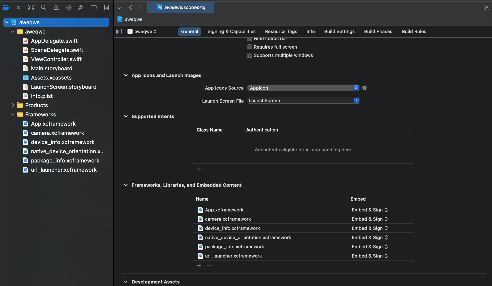

# myID SDK
MyID – bu O'zbekistonda masofaviy identifikatsiyalashning eng oson, qulay va ishonchli usuli.

## Talablar
myID SDK ni o'z loyihangizga ulashdan oldin siz bizdan maxsus `clinet_id` va `clinet_secrect` tokenlarini va SDK ni zip arxivini olishingiz kerak.

## Boshlashdan oldin
Pastda keltiriladigan kodlarni to'li ishlaydigan talqinini ushbu repozitoriyadan topish mumkun https://github.com/azamat7g/myidsdk_examples

## SDKni ulash
iOS loyihada SDKni ulashdan oldin loyihani minimum iOS versiyasini 11ga almashtirish kerak. SDKni loyihani bosh jiltiga arxivdan yoyib yuboramiz. Fayllar joylashuvi quyidagi ko'rinishga kelishi kerak:

```
├── Project
├── Project.xcodeproj
└── myID
    ├── Flutter.xcframework
    ├── App.xcframework
    ├── FlutterPluginRegistrant.xcframework
    ├── camera.xcframework
    └── ...
```

SDK jiltidagi `FlutterPluginRegistrant.xcframework` dan tashqari hamma narsani `General` > `Frameworks Libraries, and Embeded Content` qismiga Drag and Drop usuli orqali qo'shamiz. 



`Build Phases` > `Link Binary With Libraries` qismiga `FlutterPluginRegistrant.xcframework` ni qo'shamiz.


`Build Settings` > `Framework Search Paths` qismiga SDKni linkini (`$(PROJECT_DIR)/myID/`) qo'shib qo'yamiz.


## SDKni ishga tushirish

ViewController faylni ochamiz va ushbu kutibxonalarni import qilamiz

``` swift
import Flutter
import FlutterPluginRegistrant
```

SDKni chaqirib beradigan fuksiya:

``` swift
func loadEngine() {
    var uri = URLComponents()
        uri.path = "/login"
        uri.queryItems = [
            URLQueryItem(name: "client_id", value: __CLIENT_ID__),
            URLQueryItem(name: "redirect_uri", value: __REDIRECT_URL__),
            URLQueryItem(name: "scope", value: "address,contacts,doc_data,common_data"),
            URLQueryItem(name: "language", value: "uz"),
            // URLQueryItem(name: "passport", value: "AA1234567"),
            // URLQueryItem(name: "birthday", value: "01.01.2000"),
            // URLQueryItem(name: "user_hash", value: "1234567891234567"),
        ]
    
    let engine = FlutterEngine(name: "MyID engine")
    engine.run(withEntrypoint: "", initialRoute: uri.url?.absoluteString);
    GeneratedPluginRegistrant.register(with: engine);

    let viewController = FlutterViewController(engine: engine, nibName: nil, bundle: nil)
    present(viewController, animated: true, completion: nil)
    
    let channel = FlutterMethodChannel(name: "channel/myid", binaryMessenger: viewController.binaryMessenger)
    channel.setMethodCallHandler({
        (call: FlutterMethodCall, result: @escaping FlutterResult) -> Void in
        if (call.method == "result") {
            viewController.popRoute();
            
            self.resultLabel.text = "Result: \(String(describing: call.arguments))";
        }
    })
}
```

SDKni ishga tushirish uchun ushbu funksiyani ishga tushiramiz bo'ldi

```swift
@IBAction func faceScannerButton(_ sender: Any) {
    self.loadEngine()
}
```

## SDK yordamida mijoz axborot tizimi bilan MyID biometrik identifikasiya axborot tizimi o‘rtasida o‘zaro ma'lumot almashishni yo‘lga qo‘yish uchun qo‘llanma

SDK yordamida mijoz axborot tizimi bilan MyID biometrik identifikasiya axborot tizimi o‘rtasida o‘zaro ma'lumot almashishni yo‘lga qo‘yish uchun qo‘llanma

```json
{
    "grant_type": "authorization_code", //misolda keltirilgandek jo‘natish kerak
    "code": "code", //SDK orqali olingan kod
    "client_id": "CLIENT_ID", //mijoz identifikatori (myid administratori tomonidan taqdim etiladi yoki mijoz konsoli orqali olinadi)
    "client_secret": "CLIENT_SECRET", //mijoz sekreti (myid administratori tomonidan taqdim etiladi yoki mijoz konsoli orqali olinadi)
    "redirect_uri": "REDIRECT_URI", // mijoz tomonidan taqdim etiladigan qayta yo‘naltirish URL manzili
}
```

`Mobil ilova orqali client_secret parametrini saqlash yoki jo‘natish ta'qiqlanadi, client_secret orqali yuboriladigan so‘rovlar faqatgina back end tomonida amalga oshirilishi kerak.`

Javob tariqasida myid oauth 2.0 serveri mijozga token va yangilash tokenini taqdim etadi.

```json
{
  "token_type": "Bearer",
  "expires_in": "3599",
  "access_token": "here access token",
  "refresh_token": "here refresh token"
}
```

So‘ng, mijoz GET metodi orqali `…users/me` manziliga quyidagi so‘rov jo‘natadi:

`Authorization: Bearer [access_token]`

So‘rov natijasida foydalanuvchining ma'lumotlari quyidagi ko‘rinishda taqdim etiladi.

```json
{
  "profile": {
    "common_data": {
      "first_name": "string",
      "middle_name": "string",
      "last_name": "string",
      "pinfl": "string",
      "inn": "string",
      "gender": "string",
      "birth_place": "string",
      "birth_country": "string",
      "birth_date": "string",
      "nationality": "string",
      "citizenship": "string",
      "sdk_hash": "string"
    },
    "doc_data": {
      "pass_data": "string",
      "issued_by": "string",
      "issued_date": "string",
      "expiry_date": "string"
    },
    "contacts": {
      "phone": "string",
      "email": "user@example.com"
    },
    "address": {
      "permanent_address": "string",
      "temporary_address": "string",
      "permanent_registration": {
        "RegionID": "string",
        "RegionValue": "string",
        "CountryID": "string",
        "CountryValue": "string",
        "DistrictID": "string",
        "DistrictValue": "string",
        "RegistrationDate": "string",
        "Adress": "string"
      },
      "temporary_registration": {
        "RegionID": "string",
        "RegionValue": "string",
        "CountryID": "string",
        "CountryValue": "string",
        "DistrictID": "string",
        "DistrictValue": "string",
        "DateFrom": "string",
        "RegistrationDate": "string",
        "DateTill": "string",
        "Adress": "string"
      }
    },
    "authentication_method": "string"
  }
}
```

Access token yangilash uchun POST metodi bilan `…oauth2/refresh-token` manziliga quyidagi so‘rov jo‘natiladi:

```json
{
  "refresh_toke": "here refresh_token",
  "client_id": "here client_id",
  "client_secret": "here client_secret"
}
```

So‘rovga javob quyidagi ko‘rinishda keladi:

```json
{
  "access_token": "here access_token",
  "expires_in": "1359",
  "token_type": "bearer",
  "refresh_token": "here refresh_token"
}
```

| Parametr               | Tavsif                                                                                                                                                            |
| ------------------------ | ------------------------------------------------------------------------------------------------------------------------------------------------------------------- |
| first\_name              | Ism                                                                                                                                                                 |
| middle\_name             | Otasining ismi                                                                                                                                                      |
| last\_name               | Familiya                                                                                                                                                            |
| pinfl                    | Jismoniy shaxsning shaxsiy identifikasion raqami                                                                                                                    |
| inn                      | Soliq to‘lovchining identifikasion raqami                                                                                                                           |
| gender                   | 1-Erkak, 2- Ayol                                                                                                                                                    |
| birth\_place             | Tug‘ilgan joyi                                                                                                                                                      |
| birth\_country           | Tug‘ilgan davlat                                                                                                                                                    |
| birth\_country\_id       | Tug'ilgan joy ID si                                                                                                                                                 |
| birth\_date              | Tug‘ilgan sanasi                                                                                                                                                    |
| nationality              | Millati                                                                                                                                                             |
| nationality\_id          | Millat IDsi                                                                                                                                                         |
| citizenship              | Fuqaroligi                                                                                                                                                          |
| citizenship\_id          | Fuqarolik IDsi                                                                                                                                                      |
| sdk\_hash                | Keyingi so‘rovlarda SDKga shaxsni tasdiqlovchi hujjat va tug‘ilganlik sanasining o‘rniga yuborib, foydalanuvchining ma'lumotlarini olish imkonini beruvchi xesh kod |
| pass\_data               | Shaxsni tasdiqlovchi hujjatning seriyasi va raqami                                                                                                                  |
| issued\_by               | Shaxsni tasdiqlovchi hujjat berilgan joyi                                                                                                                           |
| issued\_by\_id           | Shaxsni tasdiqlovchi hujjat berilgan joy IDsi                                                                                                                       |
| issued\_date             | Shaxsni tasdiqlovchi hujjatning berilgan sanasi                                                                                                                     |
| expiry\_date             | Shaxsni tasdiqlovchi hujjatning amal qilish muddati                                                                                                                 |
| last\_update\_pass\_data | Tizimda shaxsni tasdiqlovchi hujjat oxirgi yangilangan sanasi va vaqti                                                                                              |
| last\_update\_inn        | Tizimda soliq to'lovchining identifikatsion raqami oxirgi yangilangan sanasi va vaqti                                                                               |
| last\_update\_address    | Tizimda shaxs ro'yxatdan o'tgan manzilining oxirgi yangilangan sanasi va vaqti                                                                                      |
| phone                    | Telefon raqami                                                                                                                                                      |
| email                    | Elektron pochta manzili                                                                                                                                             |
| permanent\_address       | Doimiy ro‘yhatdan o‘tish joyi                                                                                                                                       |
| temporary\_address       | Vaqtinchalik ro‘yhatdan o‘tish joyi                                                                                                                                 |
| PermanentRegistration    |
| RegionID                 | Viloyat identifikasiya raqami                                                                                                                                       |
| RegionValue              | Viloyat nomi                                                                                                                                                        |
| CountryID                | Davlat identifikasion raqami                                                                                                                                        |
| CountryValue             | Davlat nomi                                                                                                                                                         |
| DistrictID               | Tuman (shahar) identifikasion raqami                                                                                                                                |
| DistrictValue            | Tuman (shaxar) nomi                                                                                                                                                 |
| RegistrationDate         | Ro‘yhatdan o‘tish sanasi                                                                                                                                            |
| Adress                   | Manzil                                                                                                                                                              |
| TemproaryRegistrations   |
| RegionID                 | Viloyat identifikasiya raqami                                                                                                                                       |
| RegionValue              | Viloyat nomi                                                                                                                                                        |
| CountryID                | Davlat identifikasion raqami                                                                                                                                        |
| CountryValue             | Davlat nomi                                                                                                                                                         |
| DistrictID               | Tuman (shahar) identifikasion raqami                                                                                                                                |
| DistrictValue            | Tuman (shaxar) nomi                                                                                                                                                 |
| DateFrom                 | Ro‘yhatdan o‘tgan sana                                                                                                                                              |
| DateTill                 | Ro‘yhat amal qilish muddati                                                                                                                                         |
| Adress                   | Manzil                                                                                                                                                              |
| authentication\_method   | Autentifikasiya metodi (simple, strong) 

### Mijozning MyID OAUTH 2.0 serveri bilan o‘zaro ma'lumot almashish sxemasi


